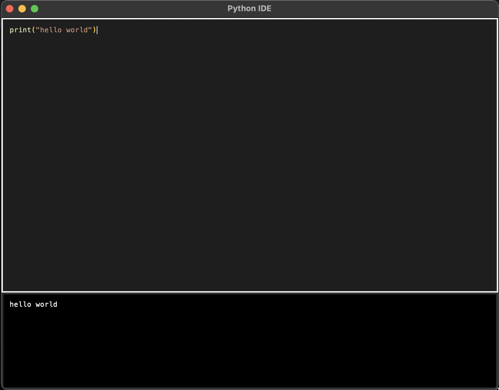
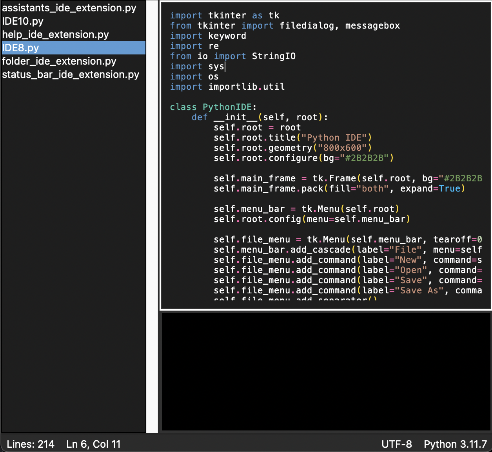

# PyIDE

PyIDE is a minimal code editor for the python programming language, with features like syntax highlighting, extension support, and more.

PyIDE supports extensions, and custom extensions!
extensions are written in python, and can be added to the PyIDE application.

